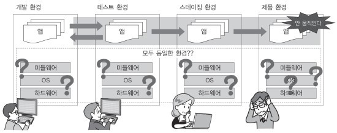
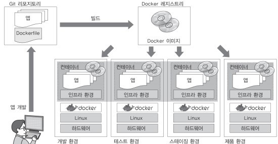
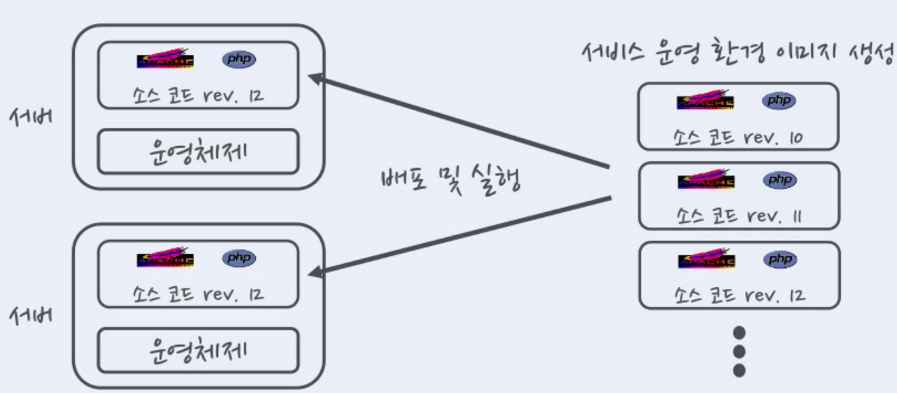
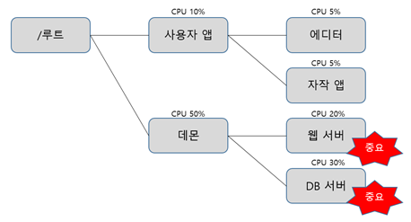

 docker_study
 
# 0.컨테이너 기술과 Docker

## 컨테이너
컨테이너란 호스트 상에 논리적인 구획(컨테이너)를 만들고, 
애플리케이션을 작동시키기 위해 필요한 라이브러리나 애플리케이션 등을 하나로 모아, 마치 별도의 서버인 것처럼 사용할 수 있도록 만든 것
>컨테이너 구조

#### 물리 서버 상에 설치한 호스트 OS의 경우:

하나의 OS 상에서 움직이는 여러 애플리케이션은 똑같은 시스템 리소스를 사용

이때 작동하는 여러 애플리케이션은 데이터를 저장하는 디렉토리를 공유하고, 서버에 설정된 동일한 IP주소로 통신함.

그래서 여러 애플리케이션에서 사용하고 있느 미들웨어나 라이브러리의 버전이 다른 경우에는 각 애플리케이션이 서로 영향을 받지 않도록 주의해야함

#### 컨테이너 기술을 사용하는 경우:

OS나 디렉토리, IP주소 등과 같은 시스템 자원을 마치 각 애플리케이션이 점유하고 있는 것처럼 보이게 할 수 있음.

즉, 애플리케이션의 실행에 필요한 모듈을 컨테이너에 모은 후 여러개의 컨테이너를 조합하여 하나의 애플리케이션을 구축할 수 있음

## Docker의 개요
Doker는 애플리케이션의 실행에 필요한 환경을 하나의 이미지로 모아두고, 그 이미지를 사용하여 다양한 환경에서 애플리케이션 실행환경을 구축 및 운용하기 위한 오픈소스플랫폼임.

웹 시스템 개발 시 애플리케이션을 제품 환경에서 가동시키기 위해서는 다음과 같은 요소가 필요함
* 애플리케이션의 실행 모듈(프로그램 본체)
* 미들웨어나 라이브러리군
* OS/네트워크 등과 같은 인프라 환경 설정
#### 일반적인 시스템 개발 흐름

개발 환경이나 테스트 환경에서는 올바르게 작동하더라도 스테이징 환경이나 제품 환경에서 정상적으로 작동하지 않을 수 있음.

스테이징 환경: 지속적 딜리버리가 일어나는 시스템 개발에서 개발한 애플리케이션을 제품 환경에 전개하기 직전에 확인하는 테스트 환경

#### Docker를 활용한 시스템 개발 흐름

Docker는 인프라 환경을 컨테이너로 관리하기 한다.

컨테이너에 애플리케이션의 실행에 필요한 모든 파일 및 디렉토리들을 컨테이너로서 모아버리는 것.
이런 컨테이너의 바탕이 되는 Docker 이미지를 Docker Hub와 같은 repository에서 공유.ㄹ

프로그래머는 Docker를 사용하여 개발한 애플리케이션의 실행에 필요한 모든 것이 포함되어 있는 Docker 이미지를 작성

이 이미지가 컨테이너의 바탕이 되어 작성한 이미지를 바탕으로 컨테이너를 가동.

이 이미지는 Docker가 설치된 모든 환경에서 작동

## Docker의 기능 
* Docker 이미지를 만드는 기능(Build)
* Docker 이미지를 공유하는 기능(Ship)
* Docker 컨테이너를 작동시키는 기능(Run)

#### Docker 이미지를 만드는 기능(Build)
Docker는 애플리케이션의 실행에 필요한 프로그램 본체, 라이브러리, 미들웨어, OS나 네트워크 설정 등을 하나로 모아서 Docker 이미지로 만듬.

Docker에서는 하나의 이미지에는 하나의 애플리케이션만 두고 여러개의 컨테이너를 조합하여 서비스를 구축하는 방법을 권장함.

또한 Docker 이미지는 명령어를 사용하여 수동으로 만들 수 있지만 Dockerfile이라는 설정 파일을 만들어 그것을 바탕으로 자동으로 이미지를 만들어 관리하는 것이 바람직함.

#### Docker 이미지를 공유하는 기능(Ship)
Docker 이미지는 Docker 레지스트리에서 공유할 수 있음

개인이 작성한 이미지를 Docker Hub에서 자유롭게 공개하여 공유할 수 있음.

#### Docker 컨테이너를 작동시키는 기능(Run)
Docker는 리눅스 상에서 컨테이너 단위로 서버기능을 작동함.

Docker 이미지는 docker가 설치된 모든 환경에서 컨테이너를 작동할 수 있고 여러개의 컨테이너를 작동할 수 있음
>한개의 이미지가 여러 컨테이너에 배포되는 모습

Docker는 하나의 linux커널을 여러개의 컨테이너에서 공유하고 있으며 컨테이너 안에서 작동하는 프로세스를 하나의 그룹으로 관리하여 그룹이 다르면 프로세스에 액세스 할 수 없음

그리고 이를 실행하기 위해 리눅스 커널 기능 기술이 사용.

## Docker의 작동 구조
#### 컨테이너를 구획화 하는 장치(namespace)
docekr는 컨터이너라는 독립된 환경을 만들고, linux 커널의 namespace라는 기능을 사용하여 그 컨테이너를 구획화하여 애플리케이션의 실행환경을 만듦

namespace란 한 덩어리의 데이터에 이름을 붙여 분할함으로써 충돌 가능성을 줄이고, 쉽게 참조할 수 있게 하는 개념임.

이름과 연결된실체는 그 이름이 어떤 namespace에 속해있는지 고유하게 정해져, namespace가 다르면 동일한 이름이라도 다른 실체로 처리됨.

다음과 같은 linux의 오브젝트에 이름을 붙여 다음과 같은 6개의 독립된 환경을 구축할 수 있음.

> PID namespace

PID란 Linux에서 각 프로세스에 할당된 고유한 ID를 말함. PID namespace는 PID와 프로세스를 격리시켜 namespace가 다른 프로세스 끼리 서로 액세스 할 수 없도록 함.

>Network namespace

Network namespace는 네트워크 디바이스, IP주소, 포트 번호, 라우팅 테이블, 필터링 테이블 등과 같은 네트워크 리소스를 격리된 namespace마다 독립적으로 가질 수있음

즉 호스트 OS상에서 사용중인 포트가 있더라도 컨테이너 안에서 동일한 번호의 포트를 사용할 수 있음

>UID namespace

UID namespace는 UID(사용자 ID), GID(그룹 ID)를 namespace별로 독립적으로 가질 수 있음.

namespace와 호스트 OS상의 ID가 서로 연결되어 서로 다른 UID/GID를 가질 수 있어, ID를 격리시킴으로서 뛰어난 보안 환경을 가질 수 있음

>MOUNT namespace

마운트란 컴퓨터에 연결된 기기나 기억장치를 OS에 인식시켜 이용 가능한 상태로 만드는 것.

MOUNT namespace는 마운트 조작을 하면 namespace 안에 격리된 파일 시스템 트리를 만듬.

>UTS namespace

UTS namespace는 namespace 별로 호스트명이나 도메인 명을 독자적으로 가질 수 있음.

>IPC namespace

IPC namespace는 프로세스 간의 통신(IPC) 오브젝트를 namespace별로 독립적으로 가질 수 있음.

*IPC는 system V 프로세스 간의 통신 오브젝트라고 하는 공유 메모리나 세마포어/메시지 큐를 말함
  * 사마포어란 프로세스가 요구하는 자원 관리에 이용되는 베타제어 장치.
  * 메시지 큐란 여러 프로세스 간에서 비동기 통신을 할때 사용되는 큐잉 장치.

#### 릴리스 관리 장치(cgroups)
Docker에서는 물리 머신 상의 자원을 여러 컨테이너가 공유하여 작동.

이때 리눅스 커널의 기능인 cgroups(control group) 기능을 사용하여 자원의 할당을 관리.

>linux에서 프로그램을 프로세스로서 실행
>플세스는 하나 이상의 스레드 모음으로 동작

cgroups는 프로세스와 스레드를 그룹화하여 그 그룹 안에 존재하는 프로세스와 스레드에 대한 관리를 수행하기 위한 기능

* cgroups로 관리할 수 있는 일

항목|설명
:---:|:---:
cpu|cpu사용량을 제한
cpuacct|cpu 사용량 통계 정보 제공
cpuset|cpu나 메모리 배치 제어
memory|메모리나 스왑 사용량을 제한
devices|디바이스에 대한 액세스 허가/거부
freezer|그룹에 속한 프로세스 정지/재개
net_cls|네트워크 제어 태그를 부가
blkio|블록 디바이스 입출력량 제어

cgroups는 계층구조를 사용하여 프로세스를 그룹화하여 관리가 가능.
>cgroups 계층구조

#### 네트워크 구성(가상 브리지/가상 NIC)

linux에서 docekr를 설치하면 서버의 물리 NIC가 docker0라는 가상 브리지 네트워크로 연결.

* docker0는 docker를 실행시킨 후에 디폴트로 만들어짐

Docker 컨테이너가 실행되면 컨테이너에 172.17.0.0/16이라는 서브넷 마스크를 가진 프라이빗 IP주소가 eth0으로 자동으로 할당

이 가상 NIC는 OSI참조모델의 레이어 2인 가상 네트워크 인터페이스로 페어인 NIC와 터널링 통신을 함.

docker 켄테이너와 외부 네트워크가 통신 할때는 가상 브리지 docker0와 호스트OS의 물리 NIC에서 패킷을 전송하는 장치가 필요.

* docker 에서는 NAPT기능을 사용하여 연결

 * NAPT란 하나의 IP주소를 여러 컴퓨터가 공유하는 기술로 IP주소와 포트 번호를 변환하는 기능. 프라이빗 IP주소와 글로벌 IP주소를 투과적으로 상호작용하는 기술, TCP/IP의 포트번호까지 동적으로 변환하기에 하나의 IP주소로 여러대의 머신이 동시에 연결할 수 있음.

  * docker에서는 NAPT에 Linux의 iptables를 사용
  
Docker에서 이 기능을 사용할 때는 컨테이너 시작 시에 컨테이너 안에서 사용하고 있는 포트를 가상 브리지인 docke0에 대해 개방함.

예를 들어

컨테이너 안의 웹서버가 사용하는 80번 포트를 호스트OS의 8080번 포트로 전송하도록 하면 외부 네트워크에서 호스트OS의 8080번 포트에 액세스하면 컨테이너 안의 80번 포트로 연결됨.

#### docker 이미지의 데이터 관리 장치

Docker는 copy on write 방식으로 컨테이너의 이미지를 관리합니다.

> copy on write란 복사를 요구 받았을때 바로 복사하지 않고, 원본 또는 복사 어느쪽에 수정이 가해진 시점에 새로 빈 영역을 확보하고 데이터를 복사하는 방식

Docker 이미지를 관리하는 스토리지 디바이스
* AUFS
* Btrfs
* Bevice Mapper
* OverlayFS
* ZFS

***

# 1. docker 시작
## docker 설치
>apt 업데이트
<pre><code> sudo apt-get update </code></pre>
>페키지 설치
<pre><code> sudo apt-get install -y \
apt-transport-https \
ca-certificates \
curl \
sotware-properties-common
</code></pre>
>GPG 키 추가
<pre><code> curl -faSL https://download.docker.com/linux/ubuntu/gpg | sudo apt-key add - </code></pre>
>GPG 키 확인
<pre><code> sudo apt-key fingerprint OEBFCD88 </code></pre> 
>repository 등록
<pre><code> sudo add-apt-repository \
"deb {arch=amd64] https://download.docker.com/linux/ubuntu \
$(lsb-release -cs) \
stable"</code></pre>
<pre><code> sudo apt-get update</code></pre>
>docker 설치
<pre><code> sudo apt-get install docekr-ce</code></pre>

## docker 컨테이너 작성 및 실행
<pre><code> docker container run <도커 이미지명> <실행할 명령> </code></pre>

## docker system
>docker 실행 환경 확인
<pre><code> docker system info</code></pre>
>docker 디스크 이용 상황
<pre><code> docker system df </code></pre>

## (ERROR) docker 권한 문제 (Got permisson denied issue in linux)
> docker grouup 생성
<pre><code> sudo groupadd docker </code></pre>
> docker group에 해당 유저를 추가
<pre><code> sudo usermod -aG docker $USER </code></pre>
> 적용
<pre><code>newgrp docker</code></pre>

***

# 2. Docker 이미지 조작
## docker 이미지 다운로드
<pre><code> docker image pull [옵션] 이미지명[:태그명] </code></pre>
*옵션

|옵션|설명|
|:-----:|:----------:|
|-all, -a|모든 이미지를 표시|
>URL을 지정하여 다운로드
<pre><code> docker image pull [URL] </code></pre>

## docker 이미지 목록 표시
<pre><code> docker image ls [옵션] [repository name] </code></pre>
* 옵션

|옵션|설명|
|:-----:|:----------:|
|-all, -a|모든 이미지를 표시|
|--digests|다이제스트를 표시|
|--no-trunc|결과를 모두 표시|
|--quiet.- q|docker 이미지 iD만 표시|

* 결과 항목

|항목|설명|
|:-----:|:----------:|
|REEPOSITORY|이미지 이름|
|TAG|이미지 태그명|
|IMAGE ID|이미지 ID|
|CREATED|작성일|
|SIZE|이미지 크기|

## 이미지 상세 정보 확인 
<pre><code> docker image inspect </code></pre>
>예시 
<pre><code>$ docker image inspect nginx 
[
    {
        "Id": "sha256:605c77e624ddb75e6110f997c58876baa13f8754486b461117934b24a9dc3a85",
        "RepoTags": [
            "nginx:latest"
        ],
        "RepoDigests": [
            "nginx@sha256:0d17b565c37bcbd895e9d92315a05c1c3c9a29f762b011a10c54a66cd53c9b31"
        ],
        ~중략~
        "Metadata": {
            "LastTagTime": "0001-01-01T00:00:00Z"
        }
    }
]
</code></pre>
결과는 JSON(JavaScript Object Notation, 텍스트 기반 데이터 포멧)형식으로 표시된다. 

>--format
* os 정보 취득
<pre><code>$ docker image inspect --format="{{ .os}}" centos:7
inux</code></pre>
* image  정보 취득
<pre><code>$ docker image inspect --format="{{ .containerConfig.Image}}" centos:7
sha256:5a28642a68c5af8083107fca9ffbc025179211209961eae9b1f40f928331fa90</code></pre>

## 이미지 태그 설정
이미지 태그에는 식병하기 쉬운 버전 명을 붙이는 것이 일반적, 

또한 Ducker Hub에 작성한 이미지를 등록하려면 이미지에 사용자명을 붙여야함
<pre><code> docker image tag 소스_이미지명[:태그명] <도커 허브 사용자명>/타겟_이미지명[:태그명] </code></pre>
* 예시
<pre><code>$ docker image ls
REPOSITORY    TAG       IMAGE ID       CREATED        SIZE
ubuntu        latest    d13c942271d6   6 days ago     72.8MB
nginx         latest    605c77e624dd   2 weeks ago    141MB
hello-world   latest    feb5d9fea6a5   3 months ago   13.3kB

$ docker image tag nginx  gongback39/webserver:1.0

$ docker image ls
REPOSITORY             TAG       IMAGE ID       CREATED        SIZE
ubuntu                 latest    d13c942271d6   6 days ago     72.8MB
nginx                  latest    605c77e624dd   2 weeks ago    141MB
gongback39/webserver   1.0       605c77e624dd   2 weeks ago    141MB
hello-world            latest    feb5d9fea6a5   3 months ago   13.3kB
</code></pre>
*태그된 이미지와 원래 이미지의 IMAGE ID가 같음

즉 실체가 똑같다.

## 이미지 검색
Docker hub에 공개되어 있는 이미지 검색
<pre><code> docker search [옵션] <검색 키워드> </code></pre>
* 옵션

옵션|설명
:--------:|:----------:
--no-trunc|결과를 모두 표시
--limit|n건의 검색 결과를 표시
--filter=stars=n|즐겨찾기의 수를 지정

* 결과 항목

항목|설명
:-------:|:-----------:
NAME|이미지 이름
DESCRIPTION| 이미지 설명 
STARS|즐겨찾기 수
OFFICIAL|공식 이미지인지 아닌지
AUTOMATED|dockerfile을 바탕으로 자동생성된 이미지인지 아닌지

docker hub에 공개되어 있는 이미지가 모두 안전한 것은 아님, 

그러므로 공식이미지 이거나 dockerfile이 제대로 공개되어있는 것을 선택해야함

## 이미지 삭제
> 작성한 이미지 삭제
<pre><code> docker image rm [옵션] 이미지명 </code></pre>
* 옵션

옵션|설명
:-----:|:---------:
--force, -f|이미지를 강제로 삭제
--no-prune|중간 이미지를 삭제하지 않음

이미지명 = REPOSITORY or IMAGE ID

> 사용하지 않는 docker 이미지를 삭제
<pre><code> docker image prune [옵션] </code></pre>
옵션|설명
:------:|:----------:
--all, -a|사용하지 않은 이미지를 모두 삭제
--force, -f|이미지를 강제로 삭제

## Docker Hub에 로그인
<pre><code> docker login [옵션] [서버] </code></pre>
옵션|설명
:-----:|:---------:
--password, -p|비밀번호
--username, -u|사용자명

옵션을 지정하지 않으면 사용자명과 비밀번호를 물어봄

서버명을 지정하지 않을시 Docker Hub에 엑서스

다른 황경에 docker repository가 있는 경우 서버명 지정

## 이미지 업로드
<pre><code> docker image push 이미지명[:태그명] </code></pre>
이때 이미지명도 사용자명과 같이 표기
<pre><code> <도커 허브 사용자명>/이미지명[:태그명} </code></pre>

## Docker Hub에서 로그아웃
<pre><code> docker logout [서버명] </code></pre>
서버명을 지정하지 않았을 떄는 Ducker Hub에 억세스함

다른 황경에 docker repository가 있는 경우 서버명 지정

***

# 3. Docker 컨테이너 
>컨테이너의 라이프 사이클

컨테이너는 다음과 같은 상태로 변화

## 컨테이너 생성
<pre><code> docker container create </code></pre>
이미지로부터 컨테이너를 생성

이미지는 'doker에서 서버 기능을 작동시키기 위해 피료한 디렉토리 및 파일들이다.

docker container create 명령은 이미지에 포함될 linux의 디렉토리와 파일들의 스냅샷(스토리지내 파일과 디렉토리를 특정 타이밍에 추출)을 취한다.

컨테이너를 작성할뿐 시작하지 않음

## 컨테이너 생성 및 시작
<pre><code> docker container run [옵션] 이미지명[:태그명] [인수] </code></pre>
옵션|설명
:-----:|:---------:
--attach, -a|표준입력(STDIN), 표준출력(STDOUT), 표준 오류 출력(STDERR)에 어테치
--cidfile|컨테이너 ID를 파일로 출력
--detach, -d|컨테이너를 생성하고 백그라운드에서 실행
--interactive, -i|컨테이너의 표준 입력을 연다.
--tty, -t|단말기 디바이스를 사용한다.

### 1) 대화식 실행
<pre><code> docker container run [옵션] <컨테이너명> 이미지명 명령 </code></pre>
* 예시
<pre><code>$ docker container run -it --name "test1" centos /bin/cal
    January 2022    
Su Mo Tu We Th Fr Sa
                   1
 2  3  4  5  6  7  8
 9 10 11 12 13 14 15
16 17 18 19 20 21 22
23 24 25 26 27 28 29
30 31               
</code></pre>
centos라는 이름의 이미지를 바탕으로 test1이라는 이름의 컨테이너를 생성 및 실행, 커넽이너 내에서 /bin/cal 실행

이때 --name을 통해 컨테이너명 지정, /bin/cal은 Linux 표준 명령

### 2) 백그라운드 실행 (디태치 모드)
<pre><code> docker container run -d 이미지명 명령 </code></pre>
* 옵션

옵션|설명
:-----:|:---------:
--detach, -d|백그라운드 실행
--user, -u|사용자명을 지정
--rm|명령 실행 완료후에 컨테이너를 자동으로 삭제
----restart=[옵션]| 명령 실행 결과ㅔ에 따라 재시작을 하는 옵션

* --restart 옵션

옵션|설명
:-----:|:---------:
no|재시작하지 않는다
on-failure|종료 스테이터스가 0이 아닐때 재시작
on-failure:횟수|종료 스테이 터스가 0이 아닐떄 횟수번 재시작
always|항상 재시작
unless-stopped|최근 컨테이너가 정지 상태가 아니라면 항상 재시작

* 예시
<pre><code>$ docker container run -d centos /bin/ping localhost
9490570e7791e87ea2719242185d3c4864c89bb01167196af675f403053a5414
</code></pre>
centos라는 이름의 이미지를 바탕으로 컨테이너를 생성, localhost에 대해 ping명령을 실행 

백그라운드 실행의 경우 결과 대신 시작된 컨테이너의 컨테이너ID가 표시

백그라운드에서 실행되고 있는지 아닌지를 확인할때는 
<pre><code> docker container log </code></pre>
를 사용함

* 예시
<pre><code>$ docker container logs -t 9490570e7791
2022-01-13T08:38:42.439279451Z PING localhost (127.0.0.1) 56(84) bytes of data.
2022-01-13T08:38:42.439327609Z 64 bytes from localhost (127.0.0.1): icmp_seq=1 ttl=64 time=0.028 ms
2022-01-13T08:38:43.440819276Z 64 bytes from localhost (127.0.0.1): icmp_seq=2 ttl=64 time=0.030 ms
2022-01-13T08:38:44.465250093Z 64 bytes from localhost (127.0.0.1): icmp_seq=3 ttl=64 time=0.071 ms
~
</code></pre>

### 3) 컨테이너의 네트워크 설정
옵션|설명
:-----:|:---------:
--add-host=[호스트명:IP주소]|컨테이너의 /etc/hosts에 호스트명과 IP주소를 정의
--dns=[IP주소]|컨테이너용 DNS서버의 IP주소 지정
--expose|지정한 범위의 포트 번호를 할당
--mac-adress=[MAC주소]|컨테이너의 MAC주소를 지정
--net=[옵션]|컨테이너의 네트워크를 지정
--hostname, -h|켄터이너 자신의 호스트명을 지정
--publish, -p[호스트의 포트 번호]:[컨테이너의 포트 번호]|호스트와 컨테이너의 포트 매핑
--publish-all -P|홋스트의 임의의 포트를 컨테이너에 할당

* 예시
<pre><code> docker container run -d -p 8080:80 nginx </code></pre>
이 명령은 nginx라는 이름의 이미지를 파타아으로 컨테이너를 생성하고 백그라운드에서 실행

이때 호스트의 포트 번호 8080과 컨테이너의 포트번호 80을 매핑함

이 명형을 실행하면 호스트의 8080포트에 액세스하면 컨테이너에서 작동하고 있는 nginx(80번 포트)의 서비스에 액세스 할 수 있음

* --net 옵션

옵션|설명
:-----:|:---------:
bidge|브리지 연결(기본값)을 사용
none|네트워크에 연결하지 않음
container:[name or id]|다른 커테이너의 네트워크를 사용
host|컨테이너가 호스트 OS의 네트워크를 사용
NETWORK|사용자 정의 네트워크를 사용

사용자 정의 내트워크의 경우
<pre><code> docker network create </code></pre>
명령을 사용하여 작성 

### 4) 자원을 지정하여 컨테이너 생성 및 실행
<pre><code> docker container run [자원 옵션] 이미지명[:태그명] [인수] </code></pre>
* 자원 옵션

옵션|설명
:-----:|:---------:
--cpu-shares, -c|cpu의 사용 배분(비율) (기본값: 1024)
--memory. -m|사용할 메모리를 제한하여 실행
--volume=[호스트의 디렉토리]:[컨테이너의 디렉토리], -v|호스트와 컨테이너를 공유

### 5) 컨테이너를 생성 및 시작하는 환경을 지정
<pre><code> docker container run [환경설정 옵션] 이미지명[:태그명] [인수] </code></pre>
* 환경설정 옵션

옵션|설명
:-----:|:---------:
--env=[환경변수], -e|환경변수를 설정
--env-file=[파일명]|환경변수를 파일로부터 설정
--read-only=[true or false]|컨테이너의 파일 시스템을 읽기 전용으로 만듦
--workdir=[패스], -w|컨테이너의 작업 디렉토리를 지정
-u, --user=[사용자명]|사용자명 또는 UID를 지정한다.

### 6) 가동컨테이너 목록 표시
<pre><code> docker container ls [옵션] </code></pre>
* 옵션

옵션|설명
:-----:|:---------:
-all, -a| 실행중 정지중인것ㄷ 포함하여 모든 컨테이너를 표시
--filter, -f|표시할 컨테이너의 필터링
--format|표시 포맷을 지정
--last, -n|마지막으로 실행된 n건의 컨테이너만 표시
--latest, -l|마지막으로 실행된 컨테이너 만 표시
--no-trunc|정보를 생략하지 않고 표시
--quiet, -q|컨테이너 ID만 표시
--size, -s|파일 크기 표시

* 결과

항목|설명
:-----:|:---------:
CONTSINER ID|컨테이너 ID
IMAGE|컨테이너의 파탕이 된 이미지
COMMAND|컨테이너 안에서 실행되고 있는 명령
CREATED|컨테이너 작성후 경과 시간
STATUS|컨테이너의 상태(restarting, running, paused, exited)
PORTS|할당된 포트
NAMES|컨테이너 이름

*--format 출력 형식
플레이스 홀더|설명
:-----:|:---------:
.ID|컨테이너 ID
.Image|이미지 ID
.Command|실행 명령
.CreatedAt|컨테이너가 작성된 시간
.RunningFor|컨테이너 가동 시간
.Ports|공개포트
.Status|컨테이너 상태
.Size|컨테이너 디스크 크기
.Names|컨테이너명
.Mounts|볼륨 마운트
.Networks|네트워크명

*예시
<pre><code>$ docker container ls -a --format "{{.Names}}: {{.Status}}"
condescending_khayyam: Up 3 hours
gifted_turing: Up 4 hours
test1: Exited (0) 4 hours ago
webserver: Exited (128) 19 hours ago
57dca1eb0756: Created
thirsty_euclid: Exited (0) 2 days ago
</code></pre>
*표형식
<pre><code>$ docker container ls -a --format "table {{.Names}}\t{{.Status}}\t {{.Mounts}}"
NAMES                   STATUS                       MOUNTS
condescending_khayyam   Up 3 hours                   
gifted_turing           Up 4 hours                   
test1                   Exited (0) 4 hours ago       
webserver               Exited (128) 19 hours ago    
57dca1eb0756            Created                      
thirsty_euclid          Exited (0) 2 days ago   
</code></pre>

### 7) 컨테이너 가동 확인
<pre><code> docker container stats [컨테이너 식별자] </code></pre>
*결과

항목|설명
:-----:|:---------:
CONTAINER ID|컨테이너 식별자
NAME|컨테이너명
CPU %|cpu사용률
MEM USAGE/LIMIT|메모리 사용량/컨테이너에서 사용할 수 있는 메모리 제한
MEM %|메모리 사용률
NET I/O|네트워크 I/O
BLOCK I/O|블록 I/O
PIDS|PID

상태 확인이 끝나면 ctrl+c를 눌러 명령 종료

또한 컨테이너에서 실행중인 프로세스를 확인할때는
<pre><code> docker container top [컨테이너명] </code></pre>
을 사용

### 8) 컨테이너 시작
<pre><code> docker container start [옵션] <컨테이너 식별자> [컨테이너 식별자] </code></pre>
옵션|설명
:-----:|:---------:
--attach, -a|표준 출력, 표준 오류 출력을 열음
--interactive, -i|컨테이너의 표준 입력을 열음

### 9)컨테이너 정지
<pre><code> docker container stop [옵션] <컨테이너 식별자> [컨테이너 식별자] </code></pre>
* 옵션

옵션|설명
:-----:|:---------:
--time, -t|컨텡이너의 정지 시간을 지정(기본값: 10초)

### 10) 컨테이너 재시작
<pre><code> docker container restart [옵션] <컨테이너 식별자> [컨테이너 식별자] </code></pre>
* 옵션

옵션|설명
:-----:|:---------:
--time, -t|컨텡이너의 정지 시간을 지정(기본값: 10초)

### 11) 컨테이너 삭제
<pre><code> docker container rm [옵션] <컨테이너 식별자> [컨테이너 식별자] </code></pre>
* 옵션

옵션|설명
:-----:|:---------:
--force, -f|실행중인 컨테이너를 강제로 삭제
--volumes, -v|할당한 볼륨 삭제

정지중인 모든 컨테이너를 삭제(정지 중인 것만을 삭제)하려면
<pre><code> docker container prune </code></pre>
를 사용 

### 12) 컨테이너 중단/재개
<pre><code> docker container pause/unpause <컨테이너 식별자> </code></pre>
