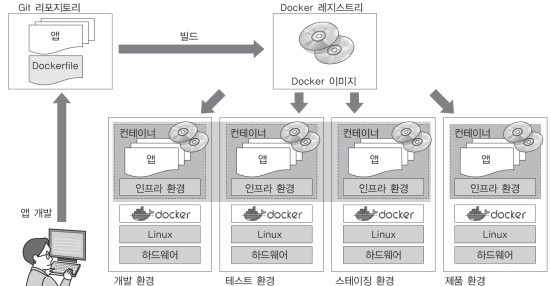

# 0.컨테이너 기술과 Docker

## 컨테이너
컨테이너란 호스트 상에 논리적인 구획(컨테이너)를 만들고, 
애플리케이션을 작동시키기 위해 필요한 라이브러리나 애플리케이션 등을 하나로 모아, 마치 별도의 서버인 것처럼 사용할 수 있도록 만든 것
>컨테이너 구조

#### 물리 서버 상에 설치한 호스트 OS의 경우:

하나의 OS 상에서 움직이는 여러 애플리케이션은 똑같은 시스템 리소스를 사용

이때 작동하는 여러 애플리케이션은 데이터를 저장하는 디렉토리를 공유하고, 서버에 설정된 동일한 IP주소로 통신함.

그래서 여러 애플리케이션에서 사용하고 있느 미들웨어나 라이브러리의 버전이 다른 경우에는 각 애플리케이션이 서로 영향을 받지 않도록 주의해야함

#### 컨테이너 기술을 사용하는 경우:

OS나 디렉토리, IP주소 등과 같은 시스템 자원을 마치 각 애플리케이션이 점유하고 있는 것처럼 보이게 할 수 있음.

즉, 애플리케이션의 실행에 필요한 모듈을 컨테이너에 모은 후 여러개의 컨테이너를 조합하여 하나의 애플리케이션을 구축할 수 있음

## Docker의 개요
Doker는 애플리케이션의 실행에 필요한 환경을 하나의 이미지로 모아두고, 그 이미지를 사용하여 다양한 환경에서 애플리케이션 실행환경을 구축 및 운용하기 위한 오픈소스플랫폼임.

웹 시스템 개발 시 애플리케이션을 제품 환경에서 가동시키기 위해서는 다음과 같은 요소가 필요함
* 애플리케이션의 실행 모듈(프로그램 본체)
* 미들웨어나 라이브러리군
* OS/네트워크 등과 같은 인프라 환경 설정
#### 일반적인 시스템 개발 흐름

개발 환경이나 테스트 환경에서는 올바르게 작동하더라도 스테이징 환경이나 제품 환경에서 정상적으로 작동하지 않을 수 있음.

스테이징 환경: 지속적 딜리버리가 일어나는 시스템 개발에서 개발한 애플리케이션을 제품 환경에 전개하기 직전에 확인하는 테스트 환경

#### Docker를 활용한 시스템 개발 흐름

Docker는 인프라 환경을 컨테이너로 관리하기 한다.

컨테이너에 애플리케이션의 실행에 필요한 모든 파일 및 디렉토리들을 컨테이너로서 모아버리는 것.
이런 컨테이너의 바탕이 되는 Docker 이미지를 Docker Hub와 같은 repository에서 공유.ㄹ

프로그래머는 Docker를 사용하여 개발한 애플리케이션의 실행에 필요한 모든 것이 포함되어 있는 Docker 이미지를 작성

이 이미지가 컨테이너의 바탕이 되어 작성한 이미지를 바탕으로 컨테이너를 가동.

이 이미지는 Docker가 설치된 모든 환경에서 작동

## Docker의 기능 
* Docker 이미지를 만드는 기능(Build)
* Docker 이미지를 공유하는 기능(Ship)
* Docker 컨테이너를 작동시키는 기능(Run)

#### Docker 이미지를 만드는 기능(Build)
Docker는 애플리케이션의 실행에 필요한 프로그램 본체, 라이브러리, 미들웨어, OS나 네트워크 설정 등을 하나로 모아서 Docker 이미지로 만듬.

Docker에서는 하나의 이미지에는 하나의 애플리케이션만 두고 여러개의 컨테이너를 조합하여 서비스를 구축하는 방법을 권장함.

또한 Docker 이미지는 명령어를 사용하여 수동으로 만들 수 있지만 Dockerfile이라는 설정 파일을 만들어 그것을 바탕으로 자동으로 이미지를 만들어 관리하는 것이 바람직함.

#### Docker 이미지를 공유하는 기능(Ship)
Docker 이미지는 Docker 레지스트리에서 공유할 수 있음

개인이 작성한 이미지를 Docker Hub에서 자유롭게 공개하여 공유할 수 있음.

#### Docker 컨테이너를 작동시키는 기능(Run)
Docker는 리눅스 상에서 컨테이너 단위로 서버기능을 작동함.

Docker 이미지는 docker가 설치된 모든 환경에서 컨테이너를 작동할 수 있고 여러개의 컨테이너를 작동할 수 있음
>한개의 이미지가 여러 컨테이너에 배포되는 모습

Docker는 하나의 linux커널을 여러개의 컨테이너에서 공유하고 있으며 컨테이너 안에서 작동하는 프로세스를 하나의 그룹으로 관리하여 그룹이 다르면 프로세스에 액세스 할 수 없음

그리고 이를 실행하기 위해 리눅스 커널 기능 기술이 사용.

## Docker의 작동 구조

