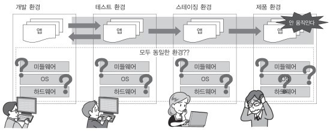
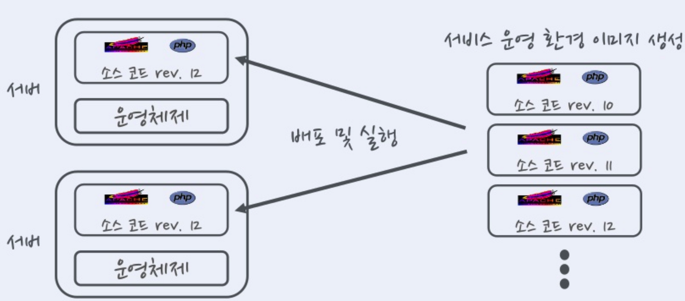
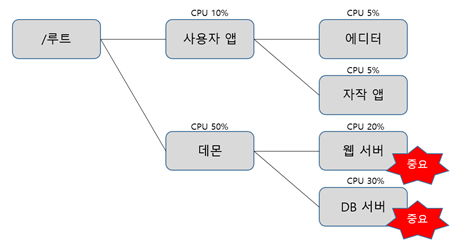

# 0.컨테이너 기술과 Docker

## 컨테이너
컨테이너란 호스트 상에 논리적인 구획(컨테이너)를 만들고, 
애플리케이션을 작동시키기 위해 필요한 라이브러리나 애플리케이션 등을 하나로 모아, 마치 별도의 서버인 것처럼 사용할 수 있도록 만든 것
>컨테이너 구조

#### 물리 서버 상에 설치한 호스트 OS의 경우:

하나의 OS 상에서 움직이는 여러 애플리케이션은 똑같은 시스템 리소스를 사용

이때 작동하는 여러 애플리케이션은 데이터를 저장하는 디렉토리를 공유하고, 서버에 설정된 동일한 IP주소로 통신함.

그래서 여러 애플리케이션에서 사용하고 있느 미들웨어나 라이브러리의 버전이 다른 경우에는 각 애플리케이션이 서로 영향을 받지 않도록 주의해야함

#### 컨테이너 기술을 사용하는 경우:

OS나 디렉토리, IP주소 등과 같은 시스템 자원을 마치 각 애플리케이션이 점유하고 있는 것처럼 보이게 할 수 있음.

즉, 애플리케이션의 실행에 필요한 모듈을 컨테이너에 모은 후 여러개의 컨테이너를 조합하여 하나의 애플리케이션을 구축할 수 있음

## Docker의 개요
Doker는 애플리케이션의 실행에 필요한 환경을 하나의 이미지로 모아두고, 그 이미지를 사용하여 다양한 환경에서 애플리케이션 실행환경을 구축 및 운용하기 위한 오픈소스플랫폼임.

웹 시스템 개발 시 애플리케이션을 제품 환경에서 가동시키기 위해서는 다음과 같은 요소가 필요함
* 애플리케이션의 실행 모듈(프로그램 본체)
* 미들웨어나 라이브러리군
* OS/네트워크 등과 같은 인프라 환경 설정
#### 일반적인 시스템 개발 흐름

개발 환경이나 테스트 환경에서는 올바르게 작동하더라도 스테이징 환경이나 제품 환경에서 정상적으로 작동하지 않을 수 있음.

스테이징 환경: 지속적 딜리버리가 일어나는 시스템 개발에서 개발한 애플리케이션을 제품 환경에 전개하기 직전에 확인하는 테스트 환경

#### Docker를 활용한 시스템 개발 흐름

Docker는 인프라 환경을 컨테이너로 관리하기 한다.

컨테이너에 애플리케이션의 실행에 필요한 모든 파일 및 디렉토리들을 컨테이너로서 모아버리는 것.
이런 컨테이너의 바탕이 되는 Docker 이미지를 Docker Hub와 같은 repository에서 공유.ㄹ

프로그래머는 Docker를 사용하여 개발한 애플리케이션의 실행에 필요한 모든 것이 포함되어 있는 Docker 이미지를 작성

이 이미지가 컨테이너의 바탕이 되어 작성한 이미지를 바탕으로 컨테이너를 가동.

이 이미지는 Docker가 설치된 모든 환경에서 작동

## Docker의 기능 
* Docker 이미지를 만드는 기능(Build)
* Docker 이미지를 공유하는 기능(Ship)
* Docker 컨테이너를 작동시키는 기능(Run)

#### Docker 이미지를 만드는 기능(Build)
Docker는 애플리케이션의 실행에 필요한 프로그램 본체, 라이브러리, 미들웨어, OS나 네트워크 설정 등을 하나로 모아서 Docker 이미지로 만듬.

Docker에서는 하나의 이미지에는 하나의 애플리케이션만 두고 여러개의 컨테이너를 조합하여 서비스를 구축하는 방법을 권장함.

또한 Docker 이미지는 명령어를 사용하여 수동으로 만들 수 있지만 Dockerfile이라는 설정 파일을 만들어 그것을 바탕으로 자동으로 이미지를 만들어 관리하는 것이 바람직함.

#### Docker 이미지를 공유하는 기능(Ship)
Docker 이미지는 Docker 레지스트리에서 공유할 수 있음

개인이 작성한 이미지를 Docker Hub에서 자유롭게 공개하여 공유할 수 있음.

#### Docker 컨테이너를 작동시키는 기능(Run)
Docker는 리눅스 상에서 컨테이너 단위로 서버기능을 작동함.

Docker 이미지는 docker가 설치된 모든 환경에서 컨테이너를 작동할 수 있고 여러개의 컨테이너를 작동할 수 있음
>한개의 이미지가 여러 컨테이너에 배포되는 모습

Docker는 하나의 linux커널을 여러개의 컨테이너에서 공유하고 있으며 컨테이너 안에서 작동하는 프로세스를 하나의 그룹으로 관리하여 그룹이 다르면 프로세스에 액세스 할 수 없음

그리고 이를 실행하기 위해 리눅스 커널 기능 기술이 사용.

## Docker의 작동 구조
#### 컨테이너를 구획화 하는 장치(namespace)
docekr는 컨터이너라는 독립된 환경을 만들고, linux 커널의 namespace라는 기능을 사용하여 그 컨테이너를 구획화하여 애플리케이션의 실행환경을 만듦

namespace란 한 덩어리의 데이터에 이름을 붙여 분할함으로써 충돌 가능성을 줄이고, 쉽게 참조할 수 있게 하는 개념임.

이름과 연결된실체는 그 이름이 어떤 namespace에 속해있는지 고유하게 정해져, namespace가 다르면 동일한 이름이라도 다른 실체로 처리됨.

다음과 같은 linux의 오브젝트에 이름을 붙여 다음과 같은 6개의 독립된 환경을 구축할 수 있음.

> PID namespace

PID란 Linux에서 각 프로세스에 할당된 고유한 ID를 말함. PID namespace는 PID와 프로세스를 격리시켜 namespace가 다른 프로세스 끼리 서로 액세스 할 수 없도록 함.

>Network namespace

Network namespace는 네트워크 디바이스, IP주소, 포트 번호, 라우팅 테이블, 필터링 테이블 등과 같은 네트워크 리소스를 격리된 namespace마다 독립적으로 가질 수있음

즉 호스트 OS상에서 사용중인 포트가 있더라도 컨테이너 안에서 동일한 번호의 포트를 사용할 수 있음

>UID namespace

UID namespace는 UID(사용자 ID), GID(그룹 ID)를 namespace별로 독립적으로 가질 수 있음.

namespace와 호스트 OS상의 ID가 서로 연결되어 서로 다른 UID/GID를 가질 수 있어, ID를 격리시킴으로서 뛰어난 보안 환경을 가질 수 있음

>MOUNT namespace

마운트란 컴퓨터에 연결된 기기나 기억장치를 OS에 인식시켜 이용 가능한 상태로 만드는 것.

MOUNT namespace는 마운트 조작을 하면 namespace 안에 격리된 파일 시스템 트리를 만듬.

>UTS namespace

UTS namespace는 namespace 별로 호스트명이나 도메인 명을 독자적으로 가질 수 있음.

>IPC namespace

IPC namespace는 프로세스 간의 통신(IPC) 오브젝트를 namespace별로 독립적으로 가질 수 있음.

*IPC는 system V 프로세스 간의 통신 오브젝트라고 하는 공유 메모리나 세마포어/메시지 큐를 말함
  * 사마포어란 프로세스가 요구하는 자원 관리에 이용되는 베타제어 장치.
  * 메시지 큐란 여러 프로세스 간에서 비동기 통신을 할때 사용되는 큐잉 장치.

#### 릴리스 관리 장치(cgroups)
Docker에서는 물리 머신 상의 자원을 여러 컨테이너가 공유하여 작동.

이때 리눅스 커널의 기능인 cgroups(control group) 기능을 사용하여 자원의 할당을 관리.

>linux에서 프로그램을 프로세스로서 실행
>플세스는 하나 이상의 스레드 모음으로 동작

cgroups는 프로세스와 스레드를 그룹화하여 그 그룹 안에 존재하는 프로세스와 스레드에 대한 관리를 수행하기 위한 기능

* cgroups로 관리할 수 있는 일

항목|설명
:---:|:---:
cpu|cpu사용량을 제한
cpuacct|cpu 사용량 통계 정보 제공
cpuset|cpu나 메모리 배치 제어
memory|메모리나 스왑 사용량을 제한
devices|디바이스에 대한 액세스 허가/거부
freezer|그룹에 속한 프로세스 정지/재개
net_cls|네트워크 제어 태그를 부가
blkio|블록 디바이스 입출력량 제어

cgroups는 계층구조를 사용하여 프로세스를 그룹화하여 관리가 가능.
>cgroups 계층구조

#### 네트워크 구성(가상 브리지/가상 NIC)

linux에서 docekr를 설치하면 서버의 물리 NIC가 docker0라는 가상 브리지 네트워크로 연결.

* docker0는 docker를 실행시킨 후에 디폴트로 만들어짐

Docker 컨테이너가 실행되면 컨테이너에 172.17.0.0/16이라는 서브넷 마스크를 가진 프라이빗 IP주소가 eth0으로 자동으로 할당

이 가상 NIC는 OSI참조모델의 레이어 2인 가상 네트워크 인터페이스로 페어인 NIC와 터널링 통신을 함.

docker 켄테이너와 외부 네트워크가 통신 할때는 가상 브리지 docker0와 호스트OS의 물리 NIC에서 패킷을 전송하는 장치가 필요.

* docker 에서는 NAPT기능을 사용하여 연결

 * NAPT란 하나의 IP주소를 여러 컴퓨터가 공유하는 기술로 IP주소와 포트 번호를 변환하는 기능. 프라이빗 IP주소와 글로벌 IP주소를 투과적으로 상호작용하는 기술, TCP/IP의 포트번호까지 동적으로 변환하기에 하나의 IP주소로 여러대의 머신이 동시에 연결할 수 있음.

  * docker에서는 NAPT에 Linux의 iptables를 사용
  
Docker에서 이 기능을 사용할 때는 컨테이너 시작 시에 컨테이너 안에서 사용하고 있는 포트를 가상 브리지인 docke0에 대해 개방함.

예를 들어

컨테이너 안의 웹서버가 사용하는 80번 포트를 호스트OS의 8080번 포트로 전송하도록 하면 외부 네트워크에서 호스트OS의 8080번 포트에 액세스하면 컨테이너 안의 80번 포트로 연결됨.

#### docker 이미지의 데이터 관리 장치

Docker는 copy on write 방식으로 컨테이너의 이미지를 관리합니다.

> copy on write란 복사를 요구 받았을때 바로 복사하지 않고, 원본 또는 복사 어느쪽에 수정이 가해진 시점에 새로 빈 영역을 확보하고 데이터를 복사하는 방식

Docker 이미지를 관리하는 스토리지 디바이스
* AUFS
* Btrfs
* Bevice Mapper
* OverlayFS
* ZFS
